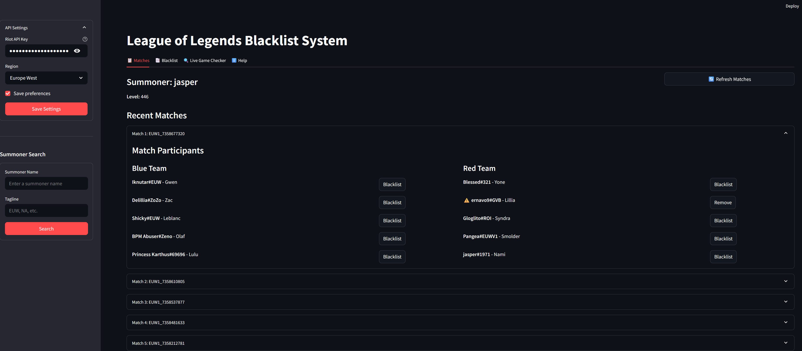

# League of Legends Blacklist System

A system for tracking and blacklisting League of Legends players. The application allows you to:

1. View your match history and blacklist players you don't want to play with
2. Check your current game to see if any blacklisted players are in the match



## Features

- **Match History Browser**: View your recent matches and add problematic players to your blacklist
- **Live Game Checker**: See if any players in your current game are blacklisted
- **Blacklist Management**: Add, remove, and view blacklisted players
- **Auto-refresh**: Automatically check for blacklisted players every 30 seconds

## Requirements

- Python 3.6+
- Riot Games API Key
- League of Legends account

## Installation

1. Clone this repository:
   ```
   git clone https://github.com/yourusername/league-blacklist.git
   cd league-blacklist
   ```

2. Install dependencies:
   ```
   pip install -r requirements.txt
   ```

## Usage

1. Run the app using the provided script:
   ```
   python run.py
   ```
   
   Or directly with streamlit:
   ```
   streamlit run app.py
   ```

2. In the sidebar, enter your Riot API Key and select your region.
   - You can choose to save your API key and region preferences for future use

3. Press the Initialize button to set up the application.

### Match History & Blacklist Tab

1. Enter your summoner name in either format:
   - Option 1: Enter your summoner name and tagline separately (e.g., name: "Jasper", tagline: "1971")
   - Option 2: Enter your full name with hashtag in the summoner name field (e.g., "Jasper#1971")
2. Click "Search" to retrieve your match history
3. Select a match from the dropdown
4. Click "Blacklist" next to any player you want to add to your blacklist
5. Add a reason for blacklisting (optional)

### Live Game Checker Tab

1. Enter your summoner name in either format (as described above)
2. Click "Check Live Game"
3. The application will show all players in your current game
4. Blacklisted players will be highlighted with warnings
5. Enable auto-refresh to periodically check for blacklisted players

## How to Get a Riot API Key

1. Go to [Riot Developer Portal](https://developer.riotgames.com/)
2. Sign in with your Riot account
3. Register a new application
4. Get your API Key from the dashboard

**Note**: Development API keys expire after 24 hours. For production applications, you'll need to apply for a production key.

## Data Storage

Blacklisted players are stored in a local CSV file (`blacklist.csv`) with the following information:
- Summoner ID
- Summoner Name
- Reason for blacklisting
- Date added

Your API key and region preferences are stored in `config.json` (this file is gitignored for security).

The system also maintains a PUUID cache in `puuid_cache.json` to minimize API calls and improve performance.

## Technical Details

### PUUID Caching

The application caches player PUUIDs to reduce API calls and avoid rate limiting. PUUIDs (Player Universally Unique IDs) are persistent identifiers used by Riot to track player accounts across name changes. This cache:

- Stores the PUUID after the first successful lookup
- Uses the cached PUUID for subsequent requests
- Improves performance and reduces API rate limit usage

### Match History Retrieval

The application attempts to retrieve match history through multiple methods:

1. First tries to get recent matches with default parameters
2. If no matches are found, tries with specific queue types:
   - Ranked Solo 5v5
   - Ranked Flex
   - Normal Draft
   - ARAM
   - Normal Blind Pick

This helps ensure that at least some matches are displayed regardless of which game modes the player prefers.

## Troubleshooting

### Common Issues:

1. **Can't find summoner**: Make sure you're entering your name correctly. You can use either:
   - Your in-game name with the hashtag (e.g., "Jasper#1971") in the Summoner Name field
   - Your name without hashtag and your tagline in separate fields

2. **API key issues**: Riot API keys for development expire after 24 hours. Renew your key at the Riot Developer Portal.

3. **No matches found**: The API may have limitations on how far back it can retrieve matches. Try playing a new match if none appear.
